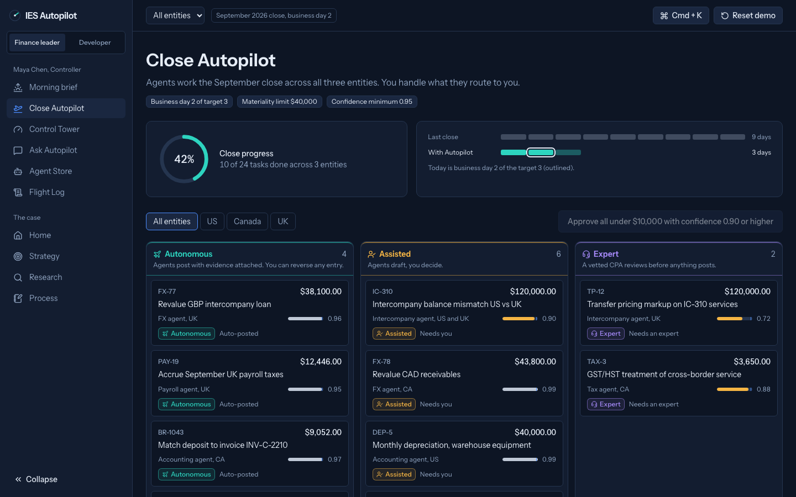

# IES Autopilot

Your finance team's AI crew, with a human expert always on call.

A clickable concept prototype for the Intuit PM Intern case: how Intuit Enterprise Suite (IES) evolves from an integrated suite into an AI-native business platform for mid-market companies. A reviewer can finish the guided tour in 10 to 15 minutes.

**Live prototype:** https://ies-autopilot.b26015.workers.dev/
> Concept prototype by Anubhab Chakraborty for the Intuit PM Intern case. Not affiliated with or endorsed by Intuit. All data is fictional.



## What it shows

| Concept | Where | What it does |
|---|---|---|
| Autopilot | `/cfo/close` | Runs the multi-entity September close as one outcome, with a lane board and task checklist |
| Autonomy Dial | `/cfo/autonomy` | Per-workflow levels L0 to L3, plus materiality and confidence guardrails, with a live preview |
| Flight Log | `/cfo/flight-log` | Every agent, human, and expert action, with filters, CSV export, and linked reversals |
| Expert on call | `/cfo/experts/new-TP-12` | One-click CPA handoff with an auto-assembled context packet |
| Ask Autopilot | `/cfo/ask` | Deterministic what-if scenarios with charts and assumptions |
| Agent Store | `/cfo/store` | Certified partner agents, scoped consent, install and uninstall |
| Hangar | `/dev` | Developer onboarding, API and MCP explorer, Agent Studio with evaluations, publish, earnings |
| Story | `/strategy`, `/research`, `/process` | Vision, pillars, roadmap, business model, research, and the AI-boosted process |

Two personas: Maya Chen, Controller at the fictional Northwind Outdoor Co. (US, Canada, UK), and Sam Okafor, founder of the fictional Rebatewise.

## How the autonomy engine works

`src/domain/autonomyEngine.ts` routes every close item to a lane. In plain words: **an agent posts on its own only when it is confident enough, the amount is strictly under your materiality limit, and the entry can be undone. Judgment categories always go to an expert. Everything else is drafted for a person.**

Checks run in this order, and each one leaves a reason the UI shows under "Why this lane":

1. Invalid data (non-finite amount, unknown currency, confidence outside 0 to 1, unknown workflow): Assisted, "Data needs checking before an agent can act".
2. Workflow at L0: Manual.
3. Expert-only category (transfer pricing, tax position, audit adjustment, new entity): Expert.
4. Confidence below the 0.50 floor: Assisted, and the agent does not draft.
5. Confidence at or above the minimum, absolute USD amount strictly below the threshold, and reversible: Autonomous at L2 or L3; Assisted at L1 with "Would auto-post at L2".
6. Otherwise: Assisted, listing every failed check.

The threshold is `revenue x materiality bps / 10000` in integer cents: 50 bps of $8,000,000 is exactly $40,000. L3 lowers the confidence minimum by 0.05, never below 0.50. At default settings the 12 seed items route 4 Autonomous, 6 Assisted, 2 Expert.

Money is integer cents and ratios are integer basis points everywhere. The demo clock is fixed at 2026-10-02 09:00 and there is no `Math.random()` in rendered data.

## Run it locally

Requires Node 20 or newer.

```bash
npm ci
npm run dev          # http://localhost:5173
```

No environment variables are needed. Optional live AI mode: copy `.env.example` to `.env` and set `ANTHROPIC_API_KEY` (and optionally `ANTHROPIC_MODEL`, default `claude-haiku-4-5-20251001`). A "Live AI mode" toggle then appears on Ask Autopilot; if it errors or takes more than 8 seconds, the scripted engine answers instead.

## Scripts

| Script | What it does |
|---|---|
| `npm run dev` | Vite dev server |
| `npm run build` | Production build into `dist/` |
| `npm run preview` | Serve the build on port 4173 |
| `npm run lint` | ESLint (typescript-eslint, react-hooks) |
| `npm run typecheck` | TypeScript strict, app and node configs |
| `npm test` | Vitest unit and component tests |
| `npm run test:e2e` | Playwright end-to-end against the production preview (desktop 1440 and mobile 375) |
| `npm run check:dashes` | Fails if an em dash or en dash appears anywhere in the repo |
| `npm run screenshots` | Saves 1440x900 screenshots of key screens into `docs/screenshots/` |
| `npm run verify` | lint + typecheck + test + check:dashes + build + test:e2e |

First e2e run on a new machine: `npx playwright install chromium`.

## Testing

- **Unit (Vitest):** autonomy engine (every seed item, boundaries, invalid input, L0 to L3), FX conversions, balanced seed entries, scenario engine, revenue share tiers, evaluation simulator, listing validators, CSV escaping, safe storage, close progress, API simulator, and store actions such as idempotent approval.
- **Component (React Testing Library):** Autonomy Dial keyboard control, approve idempotency, install consent gating, Ask send button states.
- **End-to-end (Playwright):** the 17 scenarios from the brief, including the full 12-step tour, approvals, reversals, the expert flow, store install and uninstall, developer journey, deep links, reset, mobile layout, axe accessibility scans on 16 routes, reduced motion, and a guard that fails any spec on a console error.

## Tech stack

Vite, React 18, TypeScript (strict), React Router data router, Tailwind CSS v4, Radix UI primitives, lucide-react, Recharts, Motion, Zustand with a safe persisted store, Instrument Sans via Fontsource. Vitest, React Testing Library, Playwright, and axe-core for tests.

## Folder structure

```
api/                 Vercel function for optional live AI mode (key stays server side)
src/app/             router, layout, error boundary, navigation
src/components/      UI primitives, AutonomyDial, LaneBadge, Tour, CommandPalette, charts
src/features/cfo/    brief, close, exception detail, Control Tower, experts, ask, store, Flight Log
src/features/dev/    Hangar, explorer, Agent Studio, publish, earnings
src/features/        home, strategy, research, process, 404
src/domain/          autonomy engine, FX, money, scenarios, revenue share, evals, validators, CSV, API simulator
src/data/            fictional seed data (company, close items, tasks, Flight Log, agents, experts, research, process, tour)
src/store/           Zustand store, safe storage, derived close state
tests/               unit and component tests
e2e/                 Playwright specs
scripts/             check-dashes.mjs, screenshots.mjs
docs/                ASSUMPTIONS, RESEARCH, PROMPT_LOG, DECK_OUTLINE, screenshots
```

## Disclaimer

Concept prototype by Anubhab Chakraborty for the Intuit PM Intern case. Not affiliated with or endorsed by Intuit. All company, people, partner, and financial data is fictional. No Intuit logos are used.
